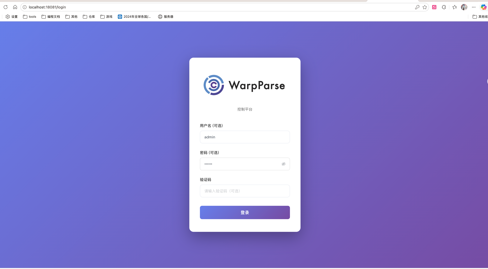
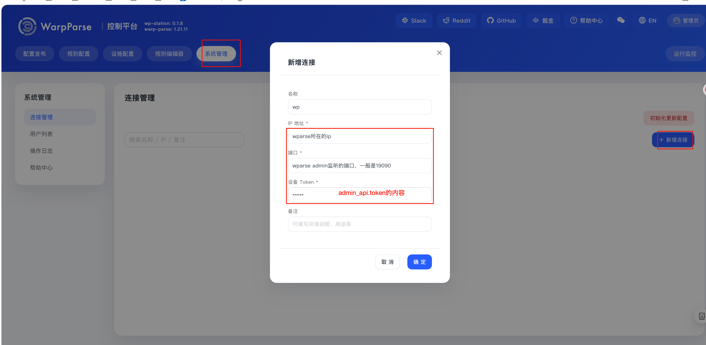

# wp-station

WarpParse 配置与发布控制台。把规则维护、知识库管理、调试验证、设备管理、版本发布、Git/Gitea 同步串联成完整工作流。

## 部署
wp-station服务，依赖包括了postgreSQL，Gitea，WarpParse设备等。
下面提供了一个基于Docker Compose的部署示例，适合快速搭建和测试环境。
```bash
git clone -b alpha https://github.com/wp-labs/wp-station.git
cd wp-station/dev-ops/docker/alpha
./start.sh
```
启动后会暴露两个服务：
- wp-station：`http://localhost:18081`，账户admin/123456。

- gitea服务： `http://localhost:13000`

## 接入wparse
### wparse侧
在wparse侧，需要开启admin模块。开启admin模块需要准备两部分内容：登录的admin_token文件，以及tls证书。具体步骤如下：

#### admin_token文件
- 创建一个`$HOME/.warp_parse/admin_api.token`文件，并在里面填入密码，例如`123456`
- 执行`chmod 600 $HOME/.warp_parse/admin_api.token`，确保文件权限正确
```bash
mkdir -p $HOME/.warp_parse
echo "123456" > $HOME/.warp_parse/admin_api.token
chmod 600 $HOME/.warp_parse/admin_api.token
```
#### TLS证书
生成TLS证书可以从受信任的CA机构中生成，也可以使用我们提供的CA自行签发。以下是使用我们提供的CA证书自行签发的步骤：
- 下载我们提供的TLS脚本，相关文件如下：
```bash
./
├── CA.crt
├── CA.key
└── gen-admin-api-cert.sh
```
- 进入到该目录后，为脚本赋予权限
```bash
cd tls
chmod +x gen-admin-api-cert.sh
```
- 使用脚本根据自己的域名或者IP，生成证书
```bash
# 根据IP生成
./gen-admin-api-cert.sh --ip 你相对于wp-station的访问IP
# 根据域名生成
./gen-admin-api-cert.sh --cn 你的域名
```
- 生成后会在当前目录下得到`server.crt`和`server.key`两个文件.
```bash
./
├── CA.crt
├── CA.key
├── CA.srl
├── gen-admin-api-cert.sh
├── server.crt  # 生成的证书文件
└── server.key  # 生成的私钥文件
```
- 将生成的`server.crt`和`server.key`文件复制到`$HOME/.warp_parse/tls`目录下。
```bash
mkdir -p $HOME/.warp_parse/tls
cp server.crt $HOME/.warp_parse/tls/
cp server.key $HOME/.warp_parse/tls/
```

#### wparse配置admin模块
- 修改`conf/wparse.toml`文件,并将前面部署的gitea ip和端口替换掉下面`project_remote`的gitea ip和端口。
```toml
[admin_api]
enabled = true
bind = "0.0.0.0:19090"      # admin模块 监听的端口
request_timeout_ms = 15000
max_body_bytes = 4096

[admin_api.auth]
mode = "bearer_token"
token_file = "${HOME}/.warp_parse/admin_api.token"

[admin_api.tls]
enabled = true
cert_file = "${HOME}/.warp_parse/tls/server.crt"
key_file = "${HOME}/.warp_parse/tls/server.key"

[project_remote]
enabled = true
repo = ""

[project_remote.models]
repo = "http://gitea的ip:gitea的端口/gitea/project_models.git"
init_version = "1.0.0"

[project_remote.infra]
repo = "http://gitea的ip:gitea的端口/gitea/project_infra.git"
init_version = "1.0.0"
```
- 启动wparse

### station侧
- 填入wparse的ip或域名和admin模块的端口，以及前面的`admin_token`。（需要注意的是这里的ip或者域名，需要与你申请TLS证书时的IP或域名一致）
